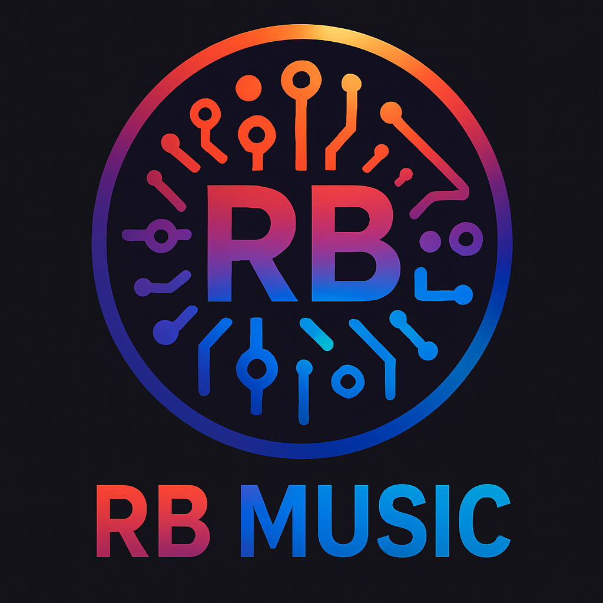

# 🎵 RB Music - Modern Music Showcase

<div align="center">
  
  <br />
  <p><em>Showcasing AI-driven and modern music compositions</em></p>
  
  [](https://rbmusic.rbtechsa.com)
  [](https://reactjs.org/)
  [](https://www.typescriptlang.org/)
  [](https://mui.com/)
</div>

## 🚀 Features

- **🎧 Music Showcase** - Browse albums with visually stunning design
- **🎵 Song Player** - Listen to featured tracks directly on the site
- **🤖 AI Music Highlights** - Discover AI-generated and AI-enhanced compositions
- **📱 Responsive Design** - Perfect viewing experience across all devices
- **⚡ Modern UI** - Sleek interface with smooth animations using Framer Motion
- **🔍 SEO Optimized** - Built-in SEO with React Helmet for better discoverability

## 🖥️ Demo

Visit the live site: [RB Music](https://rbmusic.rbtechsa.com)


## 🛠️ Tech Stack

- **Frontend Framework**: React 19 with TypeScript
- **UI Library**: Material UI v7
- **Routing**: React Router v7
- **Animations**: Framer Motion
- **State Management**: React Hooks
- **Styling**: Emotion (MUI styled components)
- **SEO**: React Helmet Async
- **Deployment**: Netlify

## 📦 Project Structure

```
src/
├── components/       # UI components (Header, Music, PlayingCard, etc.)
├── data/            # JSON data files for albums and tracks
├── hooks/           # Custom React hooks
├── pages/           # Page components
├── services/        # Services for data fetching and business logic
├── styles/          # Theme and global styles
├── types/           # TypeScript type definitions
└── utils/           # Utility functions
```

## 🏗️ Album Management

The site uses a JSON-based system for managing music content. New albums can be easily added by:

1. Adding album data to `src/data/albums.json`
2. Placing album artwork in the `public/` folder
3. Adding any new tracks to the album's `trackList` array

See the [ALBUM_DATA_README.md](./ALBUM_DATA_README.md) for detailed instructions.

## 🚀 Getting Started

### Prerequisites

- Node.js (v18 or higher)
- npm or yarn

### Installation

1. Clone the repository
   ```bash
   git clone https://github.com/yourusername/music-website.git
   cd music-website
   ```

2. Install dependencies
   ```bash
   npm install
   # or
   yarn
   ```

3. Start the development server
   ```bash
   npm start
   # or
   yarn start
   ```

4. Open [http://localhost:3000](http://localhost:3000) in your browser

## 📝 Available Scripts

- `npm start` - Run the development server
- `npm test` - Run tests
- `npm run build` - Build for production
- `npm run eject` - Eject from Create React App

## 🚢 Deployment

This project is configured for easy deployment to Netlify. The `netlify.toml` file includes:

- Build settings
- Redirect rules for SPA routing
- Security headers

## 📋 License

This project is licensed under the MIT License - see the LICENSE file for details.

## 🙏 Acknowledgements

- [Create React App](https://create-react-app.dev/) - For the initial project setup
- [Material UI](https://mui.com/) - For the beautiful UI components
- [Framer Motion](https://www.framer.com/motion/) - For smooth animations
- All musicians and contributors who make this showcase possible

---

<div align="center">
  <p>Developed with ❤️ by RBTECH</p>
  <p>© 2025 RBTECH Music. All rights reserved.</p>
</div>
